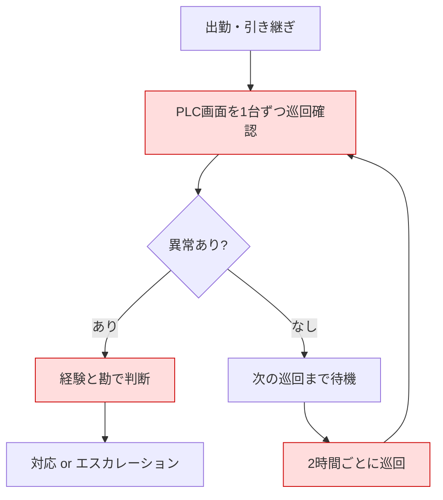
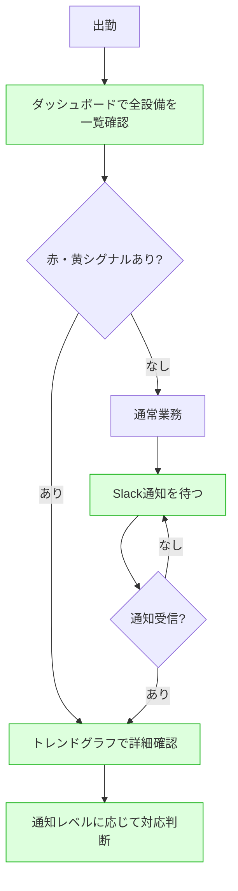
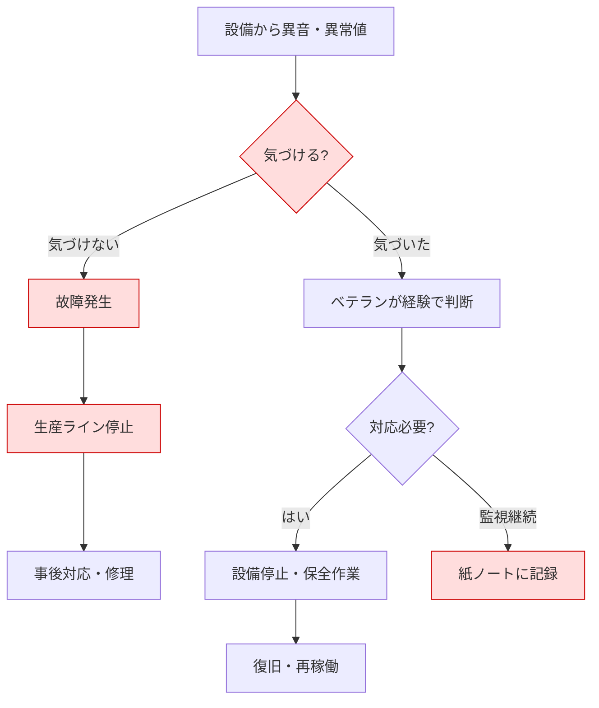
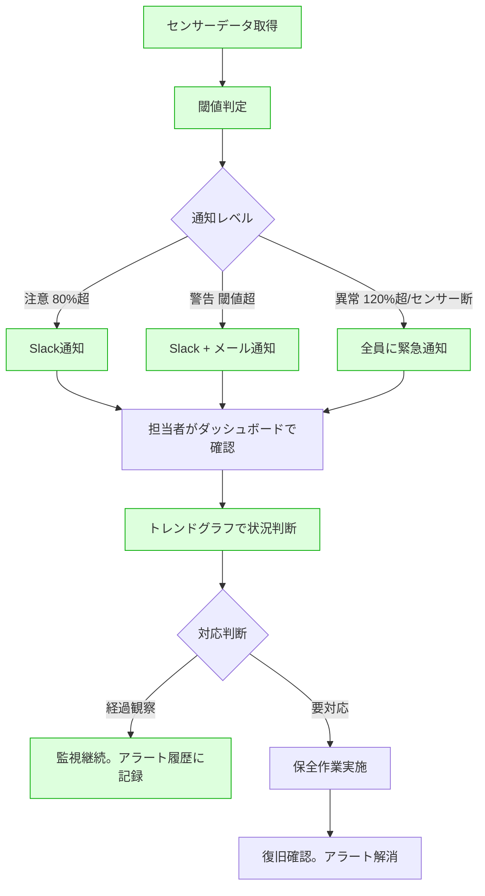
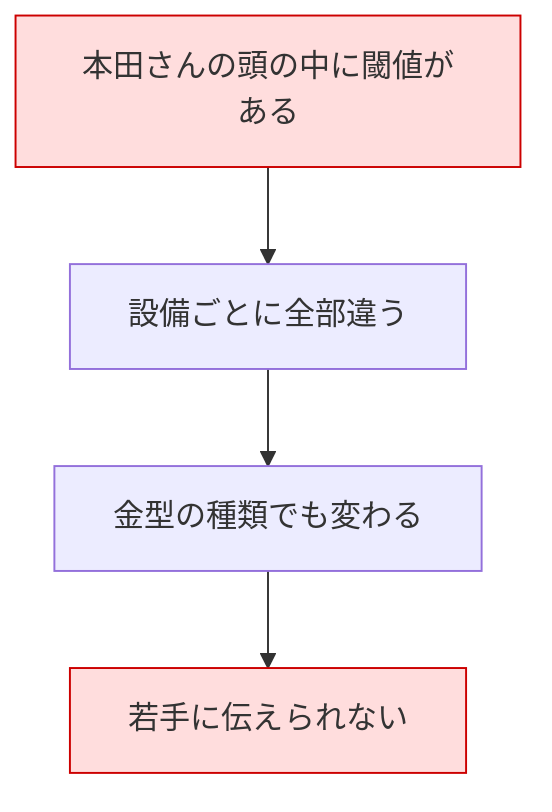
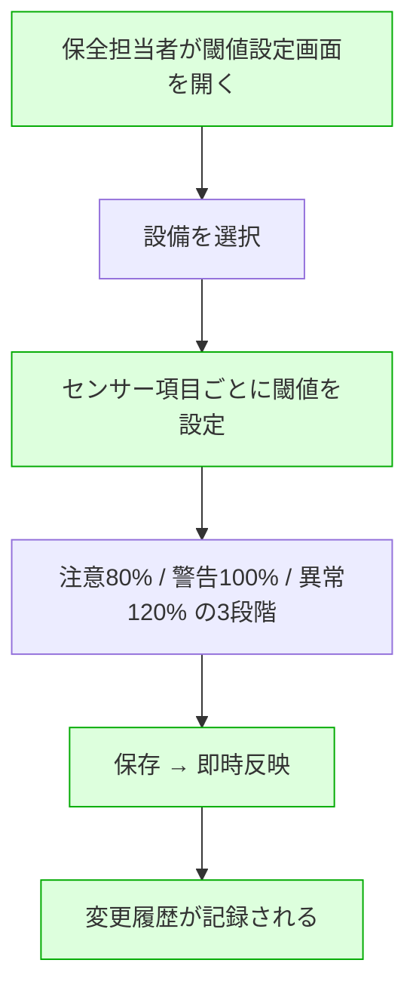
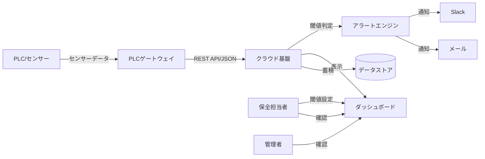

# 業務フロー — IoTアラート

> 最終更新: 2026-03-30

## 概要

東海ミスリル工業の工場保全業務における3つの主要フローを整理する。
現状（AS-IS）の課題を明確にし、システム導入後（TO-BE）でどう変わるかを定義する。

---

## 主要業務フロー

### フロー1: 設備監視フロー（日常の監視業務）

#### AS-IS（現状）

**課題:**
- PLC画面の巡回に毎回約30分かかる（17台を1台ずつ）
- 巡回間隔（2時間）の間に異常が進行するリスク
- 判断がベテラン（本田さん）の経験に依存
- 夜勤帯は1名体制で巡回品質が低下

#### TO-BE（システム導入後）

#### システムの関与ポイント

| 区分 | 内容 |
|------|------|
| 【自動化】 | PLC巡回 → ダッシュボードでリアルタイム一覧表示 |
| 【自動化】 | 異常検知 → 閾値ベースの自動判定・通知 |
| 【効率化】 | 経験による判断 → トレンドグラフで数値ベースの判断支援 |
| 【新規】 | 巡回間隔の待機 → リアルタイム監視 + プッシュ通知 |

---

### フロー2: 異常検知・対応フロー（アラート発生から対応完了まで）

#### AS-IS（現状）

**課題:**
- 異常に気づけないケースがある（特に夜勤帯）
- 故障してから対応 = 事後保全。予防保全ができていない
- 記録が紙ノートで検索・分析不可
- 夜勤の担当者は判断に迷い、深夜にベテランに電話する

#### TO-BE（システム導入後）

#### システムの関与ポイント

| 区分 | 内容 |
|------|------|
| 【自動化】 | 異常検知 → センサーデータの閾値自動判定 |
| 【自動化】 | 通知 → レベル別の自動通知（Slack/メール） |
| 【自動化】 | 通信異常検知 → センサー断のアラート |
| 【効率化】 | 判断支援 → トレンドグラフ・過去データの可視化 |
| 【新規】 | アラート履歴の自動記録 |

---

### フロー3: 閾値設定・管理フロー

#### AS-IS（現状）

**課題:**
- 閾値が暗黙知（本田さんの頭の中）
- 設備ごと × 金型種類ごとに異なり、複雑
- 若手への知識移転ができていない

#### TO-BE（システム導入後）

#### システムの関与ポイント

| 区分 | 内容 |
|------|------|
| 【新規】 | 閾値のデジタル管理（暗黙知→形式知） |
| 【効率化】 | IT部門に依頼不要。保全担当者が自分で設定変更 |
| 【新規】 | 変更履歴の自動記録（いつ誰が何を変えたか） |

---

## データフロー概要

