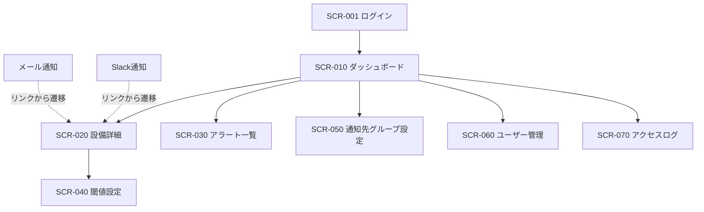

# 画面一覧・遷移 — IoTアラート

> 最終更新: 2026-03-30

---

## 画面一覧

| ID | 画面名 | 種別 | 概要 | 主要機能 | 関連ストーリー | リリース |
|----|--------|------|------|---------|--------------|---------|
| SCR-001 | ログイン | 入力 | ユーザー認証 | メール+パスワード入力 | A-020, BR-013 | MVP |
| SCR-010 | ダッシュボード（設備一覧） | ダッシュボード | 全設備の状態を一覧表示 | 赤黄青シグナル、設備名、最新センサー値、拠点フィルタ | S-001, S-002, S-003, M-001 | MVP |
| SCR-020 | 設備詳細 | 詳細 | 個別設備のセンサー情報 | リアルタイムセンサー値、トレンドグラフ、閾値ライン表示、アラート状態 | S-020, S-021, S-022, S-030 | MVP |
| SCR-030 | アラート一覧 | 一覧 | 発生中・過去のアラート一覧 | フィルタ（レベル/設備/期間）、ステータス表示 | S-041 | v1 |
| SCR-040 | 閾値設定 | 入力 | 設備ごとのセンサー閾値を設定 | 設備選択、センサー項目ごとの閾値入力、保存 | A-001, BR-009, BR-010 | MVP |
| SCR-050 | 通知先グループ設定 | 入力 | 通知先グループの管理 | グループ作成（拠点×設備種別）、メンバー追加/削除 | A-010, BR-012 | MVP |
| SCR-060 | ユーザー管理 | 一覧/入力 | ユーザーの追加・削除・権限設定 | ユーザー一覧、追加、権限変更 | A-020 | MVP |
| SCR-070 | アクセスログ | 一覧 | 操作ログの閲覧 | 日時、ユーザー、操作内容のログ一覧 | A-022, BR-014 | v1 |

---

## 画面遷移



---

## 画面構成イメージ（主要画面）

### SCR-010 ダッシュボード（設備一覧）

```
+----------------------------------------------------------+
| IoT Alert                    [拠点: 全拠点 ▼] [ユーザー▼] |
+----------------------------------------------------------+
| 本社工場                                                   |
| +------------+ +------------+ +------------+ +----------+ |
| | プレス1号機 | | プレス2号機 | | プレス3号機 | | ...      | |
| |   🔵 正常   | |   🟡 注意   | |   🔴 警告   | |          | |
| | 温度: 58℃  | | 温度: 63℃  | | 温度: 72℃  | |          | |
| | 振動: 2.1   | | 振動: 3.8   | | 振動: 5.2   | |          | |
| +------------+ +------------+ +------------+ +----------+ |
|                                                            |
| +------------+ +------------+ +------------+ +----------+ |
| | 溶接ロボ1  | | 溶接ロボ2  | | 塗装ライン1 | | ...      | |
| |   🔵 正常   | |   🔵 正常   | |   🔵 正常   | |          | |
| +------------+ +------------+ +------------+ +----------+ |
+----------------------------------------------------------+
```

### SCR-020 設備詳細

```
+----------------------------------------------------------+
| ← 戻る    大型プレス1号機           状態: 🟡 注意         |
+----------------------------------------------------------+
| センサー値（リアルタイム）                                  |
| +------------------------+  +------------------------+    |
| | 金型温度: 63.2℃        |  | 振動: 3.8 mm/s         |    |
| | 閾値: 65℃  (97%)      |  | 閾値: 5.0 mm/s (76%)  |    |
| +------------------------+  +------------------------+    |
|                                                            |
| トレンドグラフ（過去24時間）       [1h] [6h] [24h] [7d]    |
| ┌──────────────────────────────────────────┐               |
| │    ___                    閾値ライン ---- │               |
| │   /   \      ___         ─────────────── │               |
| │  /     \    /   \                        │               |
| │ /       \__/     \___                    │               |
| └──────────────────────────────────────────┘               |
|                                                            |
| アラート履歴                                                |
| | 10:23 | 注意 | 金型温度 63.2℃（閾値80%超え）|             |
| | 09:15 | 正常 | 金型温度 52.1℃（正常復帰）  |             |
+----------------------------------------------------------+
| [閾値設定 →]                                               |
+----------------------------------------------------------+
```

### SCR-040 閾値設定

```
+----------------------------------------------------------+
| ← 戻る    閾値設定: 大型プレス1号機                        |
+----------------------------------------------------------+
| センサー項目    | 閾値（警告） | 注意（80%） | 異常（120%）|
|----------------|-------------|------------|-------------|
| 金型温度 (℃)   | [  65.0  ]  |  52.0      |  78.0       |
| 振動 (mm/s)    | [   5.0  ]  |   4.0      |   6.0       |
| 油圧 (MPa)     | [  18.0  ]  |  14.4      |  21.6       |
+----------------------------------------------------------+
| ※ 注意（80%）・異常（120%）は警告閾値から自動計算          |
|                                                            |
|                              [キャンセル] [保存]           |
+----------------------------------------------------------+
```
